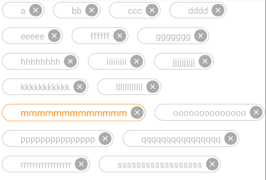

# hzclabel
android Automatic expansion label

#直接上图

#How to Use ?

不装逼了，就用中文吧

用法很简单 
使用`com.hzc.label.LabelView`控件加入layout.xml中到你需要摆放的区域
在初始化的时候最简单的使用方式如下

    tag = (LabelView) findViewById(R.id.tag);
    List<String> list = new ArrayList<>();
    list.add("a");
    list.add("bb");
    list.add("ccc");
    list.add("ppppppppppppppp");
    list.add("qqqqqqqqqqqqqqqq");
    list.add("rrrrrrrrrrrrrrrrr");
    list.add("ssssssssssssssssss");
    LabelView.TagAdapter adapter = tag.new TagAdapter<String>(list) {
        //每个label中显示的文本
        @Override
        public String getText(String o) {
            return o;
        }
		//
        @Override
        public void onClick(String s) {

        }
		//
        @Override
        public void onDelete(String s) {

        }
        
        //当前的label是否启用删除按钮
        @Override
        public boolean enableDelete(String s) {
            return super.enableDelete(s);
        }
    };
    tag.setAdapter(adapter);

#进阶
tag.setEnableDelete() //是否启用删除功能
tag.setThemeNormal();//设置label的正常主题  @style
tag.setThemeSelected();//设置label的选中主题 @style